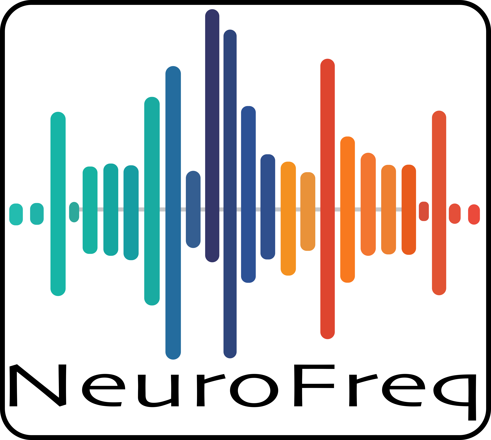

# NeuroFreq

NeuroFreq, a MATLAB toolbox for flexible time-frequency analysis of M/EEG data. Read my documentation at: https://neurofreq-public.readthedocs.io/en/latest/index.html. The NeuroFreq Toolbox is described in the accompanying preprint: https://www.biorxiv.org/content/10.1101/2023.11.01.565154v1. 

The graphic user interface is invoked by typing 'neurofreq' at the MATLAB command line. The high-level utilities for data preparation, TF-transformation, resampling, and averaging/baseline correction, are included in the /utilities folder. The TF transforms themselves are optimized for 1/2/3D matrices consisting of time series, channels X times, or channels X times X trials. These functions are included in the /transforms folder. Tools for visualizing the resulting TF transforms are located in the /visualization folder. 

There is a readme file in each subfolder describing these contents more closely. 

Demonstrations of the toolbox that reproduce the results from the paper are found in the /demo/ folder.
