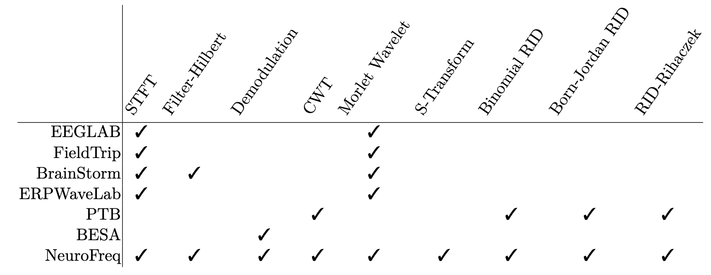

# NeuroFreq
NeuroFreq is an open-source MATLAB toolbox for flexible time-frequency analysis of human brain electrophysiological fields recorded using EEG, MEG, and ECoG.

Time-frequency (TF) analysis is a vital tool for interpreting brain electrophysiological data including electroencephalography (EEG) and magnetoencephalography (MEG), but insights offered by TF analysis are tempered by practical challenges and inconsistencies in the application of these methods. For one example, there are many different algorithms for time-frequency analysis, and each of them has distinct strengths and weaknesses. Existing software packages largely remove the freedom of choice to go between these different transforms because they only include one or at most a few options for TF transformation. NeuroFreq includes a greater variety of time-frequency transformation algorithms than existing toolboxes, and is flexible with the capability to run both linear and quadratic time-frequency transformations.

The NeuroFreq Toolbox is described in the accompanying preprint: https://www.biorxiv.org/content/10.1101/2023.11.01.565154v2. Read the NeuroFreq documentation at: https://neurofreq-public.readthedocs.io/en/latest/index.html. The documentation includes tutorials for common analyses as well as more information on the core functions of NeuroFreq.

# How to cite NeuroFreq
NeuroFreq is currently a preprint, and any and all input is welcome. Until NeuroFreq is published as a peer-reviewed item, please cite the preprint if you have used our software for your data analysis.