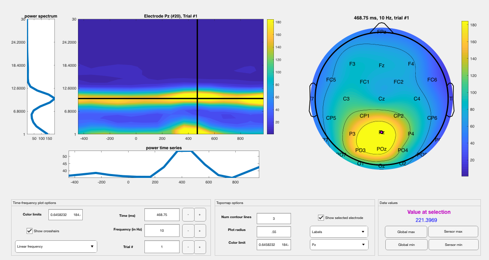

demo: eeglab sample dataset
===========================

A sample dataset from a visual experiment is released with EEGLAB software (Delorme & Making, 2004). We also include this dataset in our demo folder. Here we demonstrate how to apply all of the TF algorithms to real EEG data using this sample dataset.

First, we need to load the data using the EEGLAB pop_loadset() function:

.. code-block:: matlab
   
  EEG = pop_loadset( '/demo/eeglab_sample.set' );

Remove the two EOG channels:

.. code-block:: matlab

  EEG = pop_select( EEG, 'nochannel', {'EOG1','EOG2'});

Define our times and frequencies of interest:

.. code-block:: matlab

  foi=1:1:30;
  toi=[-.5 1];

Now, mean-center the data, remove quadratic trends, and apply a cosine-square (Tukey) taper to the end 5% of the segments prior to TF decomposition:

.. code-block:: matlab

  EEG = nf_prepdata( EEG );

Calculate all of the different time-frequency transforms using default methods:

.. code-block:: matlab

  %First Class: Linear Decompositions
  TF1 = nf_tftransform(EEG,'plt',0,'freqs',foi,'times',toi,...
    'method', 'stft');               %matlab spectrogram (STFT)
  TF2 = nf_tftransform(EEG,'plt',0,'freqs',foi,'times',toi,...
    'method','filterhilbert');      %filter-Hilbert
  TF3 = nf_tftransform(EEG,'plt',0,'freqs',foi,'times',toi,...
    'method', 'demodulation');        %complex demodulation
  TF4 = nf_tftransform(EEG,'plt',0,'freqs',foi,'times',toi,...
    'method',  'wavelet');           %Morlet discretized wavelet
  TF5 = nf_tftransform(EEG,'plt',0,'freqs',foi,'times',toi,...
    'method',  'cwt');                  %Continuous Wavelet Transform
  TF6 = nf_tftransform(EEG,'plt',0,'freqs',foi,'times',toi,...
    'method',  'stransform');           %Stockwell Transform
  %Second Class: Quadratic Distributions
  TF7 = nf_tftransform(EEG,'plt',0,'freqs',foi,'times',toi,...
    'method',  'ridbinomial');        %Type-II Binomial RID
  TF8 = nf_tftransform(EEG,'plt',0,'freqs',foi,'times',toi,...
    'method',  'ridbornjordan');      %Type-II Born-Jordan RID
  TF9 = nf_tftransform(EEG,'plt',0,'freqs',foi,'times',toi,...
    'method',  'ridrihaczek');        %RID-Rihaczek TFD

Note that the nf_tftransform function can pass default arguments to each TF method.

Now, average each of the TF structures. Do not apply a baseline:

.. code-block:: matlab

  TFA1 = nf_avebase(TF1,'none');
  TFA2 = nf_avebase(TF2,'none');
  TFA3 = nf_avebase(TF3,'none');
  TFA4 = nf_avebase(TF4,'none');
  TFA5 = nf_avebase(TF5,'none');
  TFA6 = nf_avebase(TF6,'none');
  TFA7 = nf_avebase(TF7,'none');
  TFA8 = nf_avebase(TF8,'none');
  TFA9 = nf_avebase(TF9,'none');

The individual outputs can be examined using the following as an example (for the STFT):

.. code-block:: matlab
  
  nf_viewerapp( TFA1 );

Which will produce the following:

