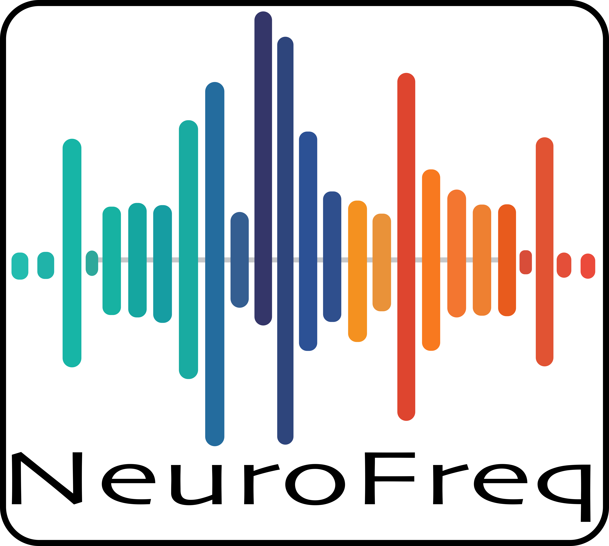

NeuroFreq Documentation
=======================

Time-frequency (TF) analysis of M/EEG data enables rich understanding of cortical dynamics underlying cognition, health, and disease. 

This documentation describes the NeuroFreq toolbox for MATLAB, which includes multiple TF transformation algorithms that are implemented in a consistent fashion and produce consistent output.

The toolbox includes TF decomposition algorithms of both linear and quadratic classes, utilities for resampling, averaging, and baseline correction of TF representations, and tools for visualizing and interacting with single-trial or averaged TF representations over multiple channels.

The source code of this project is located in its repository on GitHub: https://github.com/erawls-neuro/NeuroFreq_public.

The NeuroFreq bioRxiv preprint can be found at: https://www.biorxiv.org/content/10.1101/2023.11.01.565154v1.

NeuroFreq is developed by Eric Rawls, Ph.D.

.. toctree::
   :maxdepth: 2
   :caption: Contents:

   utilities/index
   transforms/index
   apps/index
   demo/index
   tutorials/index

