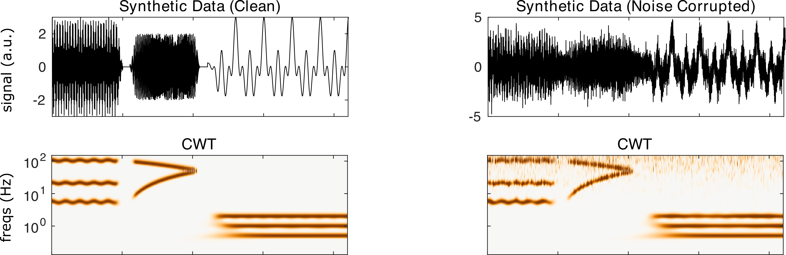

nf_cwt
======

The Continuous Wavelet Transform (CWT) transforms data to a TF representation using wavelets, which are complex sine waves multiplied by a window function that localizes the wavelet energy at the center time. The CWT scales and translates a “mother wavelet” by dilating it in time, localizing different frequencies in the process. CWT is calculated using

.. code-block:: matlab
   
  TF = nf_cwt( data, Fs, plt );

Where data is a 1/2/3D tensor of dimensions channels X time X trials, Fs is the sampling rate of the data in Hz, and plt is 0 or 1 indicating whether or not the user would like a summary plot to be produced following transformation. Note that for Morlet wavelets, the MATLAB function cwt.m does not allow modifying the number of cycles.

Defaults are: plt = 0. Data and Fs are required.

When CWT is run on the demo synthetic data using

.. code-block:: matlab
  
  TF = nf_cwt( data, 500 );

We obtain the following result:

Note that the CWT returns log-spaced frequencies, and has good resolution at low frequencies.
