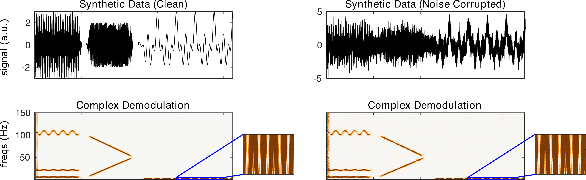

nf_demodulation
===============

Complex Demodulation calculates time-frequency representations by first multiplying the real-valued signal by a complex sine wave of a specific frequency, which demodulates the power at that frequency so that it is concentrated at low frequencies. Then, the signal is low-pass filtered in order to recover power and phase at the frequency of the sine wave. Complex demodulation is calculated using

.. code-block:: matlab
   
  TF = nf_demodulation( data, Fs, freqs, lowpassF, order, plt );    

Where data is a 1/2/3D tensor of dimensions channels X time X trials, Fs is the sampling rate of the data in Hz, freqs is a vector of center frequencies for the sine waves, lowpassF is the frequency of the low-pass filter in Hz, order is the order of the low-pass filter, and plt is 0 or 1 indicating whether or not the user would like a summary plot to be produced following transformation.

When demodulation is run on the demo synthetic data using

.. code-block:: matlab
  
  TF = nf_demodulation( data, 500 );

We obtain the following result:

Note that demodulation is noise-resistant but does not have excellent resolution at low frequencies.