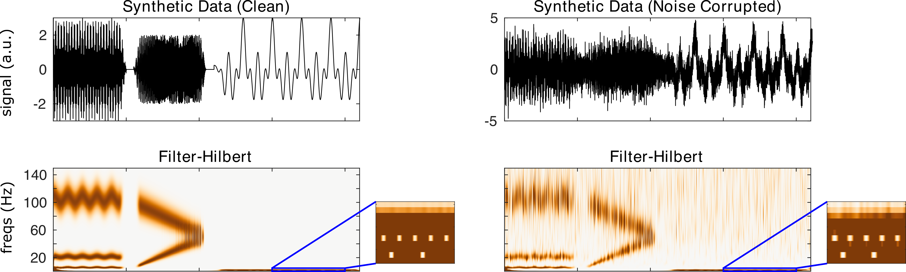

nf_filterhilbert
================

The filter-Hilbert method filters M/EEG signals into specified frequency bands using Butterworth filters. Users may select the order of the filter and the bandwidth of the filter. The filter-Hilbert transform is calculated using

.. code-block:: matlab
  
  TF = nf_filterhilbert( data, Fs, freqs, fBandWidth, order, plt );

Where data is a 1/2/3D tensor of dimensions channels X time X trials, Fs is the sampling rate of the data in Hz, freqs is a vector of center frequencies for filtering, fBandWidth is the frequency bandwidth of the filters, order is the order of the filters, and plt is 0 or 1 indicating whether or not the user would like a summary plot to be produced following transformation. fBandWidth can be specified as a single element (e.g. 1) in which case all filters will use the same width, or as a two-element vector (e.g. [1 6]) in which case the bandwidth of filters will be 1 Hz at the lowest frequency and will linearly increase to 6 Hz at the highest frequency.

Defaults are: freqs = 1:1:Fs/2, fBandWidth = 1, order = 3, plt = 0. Data and Fs are required.

When filter-Hilbert is run on the demo synthetic data using

.. code-block:: matlab
  
  TF = nf_filterhilbert( data, 500 );

We obtain the following result:

