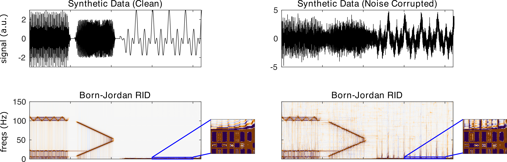

nf_ridbornjordan
================

The Born-Jordan Distribution, a member of Cohen's (1995) class, applies a rectangular kernel in the ambiguity domain. The BJD was proposed in Cohen (1966). The BJD is computed using

.. code-block:: matlab
  
  TF = nf_ridbornjordan( data, Fs, fRes, kernel, makePos, plt );

where data is a 1/2/3D tensor of dimensions channels X time X trials, Fs is the sampling rate of the data in Hz, fRes is the desired frequency resolution of the output in Hz (e.g. 0.5 produces a TF representation with frequency steps equal to 0.5 Hz), kernel is the length of the kernel in seconds, makePos is 0 or 1 indicating whether the distribution should return only positive energy, and plt is 0 or 1 indicating whether or not the user would like a summary plot to be produced following transformation. Shorter kernels more effectively mask cross-terms, but also smear the TF representation. Note that only interference terms can take on negative values, so makePos can potentially return a clearer TF representation. 

Defaults are: fRes = as many frequency samples as time samples, kernel = twice the length of the sample, makePos = 0, plt = 0. Data and Fs are required.

When the Born-Jordan is run on the demo synthetic data using

.. code-block:: matlab
  
  TF = nf_ridbornjordan( data, 500 );

We obtain the following result:

References
^^^^^^^^^^
Cohen, L. (1995). Time-frequency analysis (Vol. 778). New Jersey: Prentice hall.

Cohen, L. (1966). Generalized phase-space distribution functions. Journal of Mathematical Physics, 7(5), 781-786.