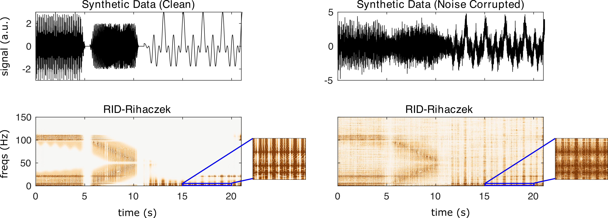

nf_ridRihaczek
==============

The Reduced Interference Distribution Rihaczek (Aviyente et al., 2011) smoothes the Rihaczek distribution (Rihaczek, 1968) by applying a Choi-Williams (1989) (exponential) kernel in in the ambiguity domain. The RID-Rihaczek is computed using

.. code-block:: matlab
   
  TF = nf_ridRihaczek( data, Fs, fRes, kernel, makePos, plt );

where data is a 1/2/3D tensor of dimensions channels X time X trials, Fs is the sampling rate of the data in Hz, fRes is the desired frequency resolution of the output in Hz (e.g. 0.5 produces a TF representation with frequency steps equal to 0.5 Hz), kernel is the kernel parameter (default .001), makePos is 0 or 1 indicating whether the distribution should return only positive energy, and plt is 0 or 1 indicating whether or not the user would like a summary plot to be produced following transformation. Note that only interference terms can take on negative values, so makePos can potentially return a clearer TF representation. 

Defaults are: fRes = as many frequency samples as time samples, kernel = 0.001, makePos = 1, plt = 0. Data and Fs are required.

When RID-Rihaczek is run on the demo synthetic data using

.. code-block:: matlab
  
  TF = nf_ridRihaczek( data, 500 );

We obtain the following result:

References
^^^^^^^^^^
Aviyente S, Bernat EM, Evans WS, Sponheim SR. A phase synchrony measure for quantifying dynamic functional integration in the brain. Hum Brain Mapp. 2011 Jan;32(1):80-93. doi: 10.1002/hbm.21000. PMID: 20336687; PMCID: PMC6870375.

Rihaczek, A. (1968). Signal energy distribution in time and frequency. IEEE Transactions on information Theory, 14(3), 369-374.

Choi, H. I., & Williams, W. J. (1989). Improved time-frequency representation of multicomponent signals using exponential kernels. IEEE Transactions on Acoustics, Speech, and Signal Processing, 37(6), 862-871.