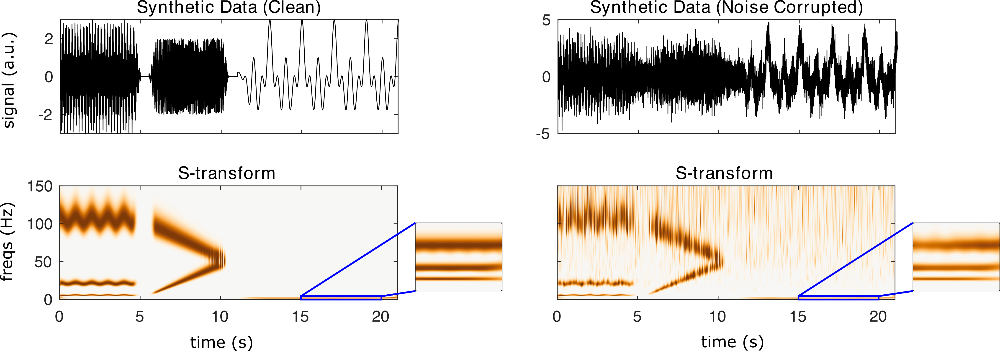

nf_sTransform
=============

The S-transform combines the advantages of both STFT and wavelet methods, and can potentially provide a clearer, more detailed time-frequency representation of M/EEG data compared to either method used alone. The S-transform is calculated using 

.. code-block:: matlab
   
  TF = nf_sTransform( data, Fs, plt );

Where data is a 1/2/3D tensor of dimensions channels X time X trials, Fs is the sampling rate of the data in Hz, and plt is 0 or 1 indicating whether or not the user would like a summary plot to be produced following transformation.

When S-transform is run on the demo synthetic data using

.. code-block:: matlab
  
  TF = nf_sTransform( data, 500 );

We obtain the following result:

Note that the S-transform has excellent resolution at low-frequencies.