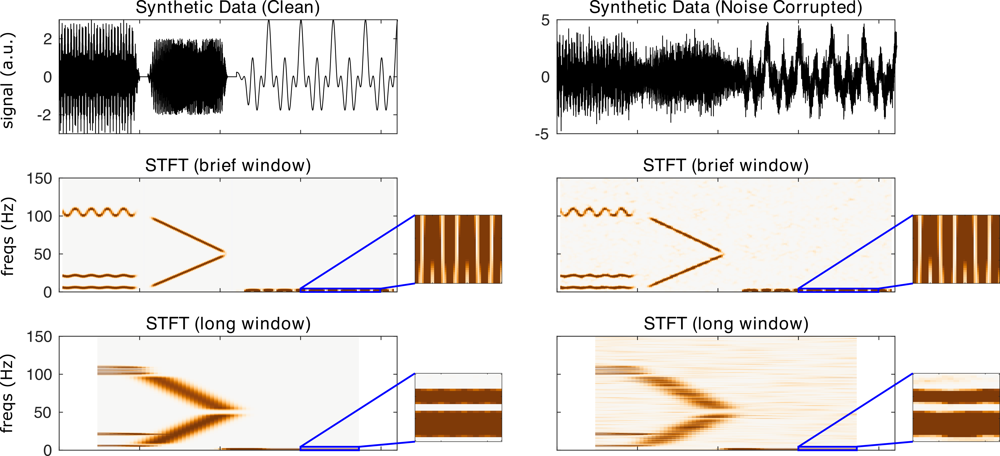

nf_stft
=======

The STFT functions by cutting data into windows of a specified length and with a specified percentage overlap. The data segments are then windowed and a discrete Fourier transform is computed on each data segment. The STFT is calculated using

.. code-block:: matlab
   
  TF = nf_stft( data, Fs, window, overlap, fRes, plt );

Where data is a 1/2/3D tensor of dimensions channels X time X trials, Fs is the sampling rate of the data in Hz, window is the length of the window in seconds, overlap is the percentage of overlap, fRes is the requested frequency resolution, and plt is 0 or 1 indicating whether or not the user would like a summary plot to be produced following transformation.

When STFT is run on the demo synthetic data with a brief 0.5 s window using

.. code-block:: matlab
  
  TF = nf_stft( data, 500, 0.5, 80 );

We obtain the 'brief' result, and when STFT is run on the demo synthetic data with a long 10 s time window using

.. code-block:: matlab
  
  TF = nf_stft( data, 500, 10, 95 );

We obtain the following:

Note the time-frequency trade-off.