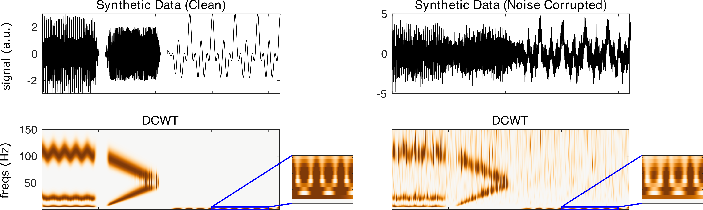

nf_wavelet
==========

The discretized continuous wavelet transform (DCWT) adapts the CWT for use with discrete frequency vectors. The DCWT reduces the computational demands of CWT. DCWT is calculated using

.. code-block:: matlab
   
  TF = nf_wavelet( data, Fs, freqs, cycles, plt );
 
Where data is a 1/2/3D tensor of dimensions channels X time X trials, Fs is the sampling rate of the data in Hz, freqs is a vector of center frequencies for the wavelets, cycles is the number of cycles in each wavelet, and plt is 0 or 1 indicating whether or not the user would like a summary plot to be produced following transformation. Cycles can be specified as a single element (e.g. 3) in which case all wavelets will contain 3 cycles, or as a two-element vector (e.g. [3 8]) in which case the number of cycles will being at 3 at the lowest frequency and will linearly increase to 8 cycles at the highest frequency.

When DCWT is run on the demo synthetic data using

.. code-block:: matlab
  
  TF = nf_wavelet( data, 500 );

We obtain the following result:

