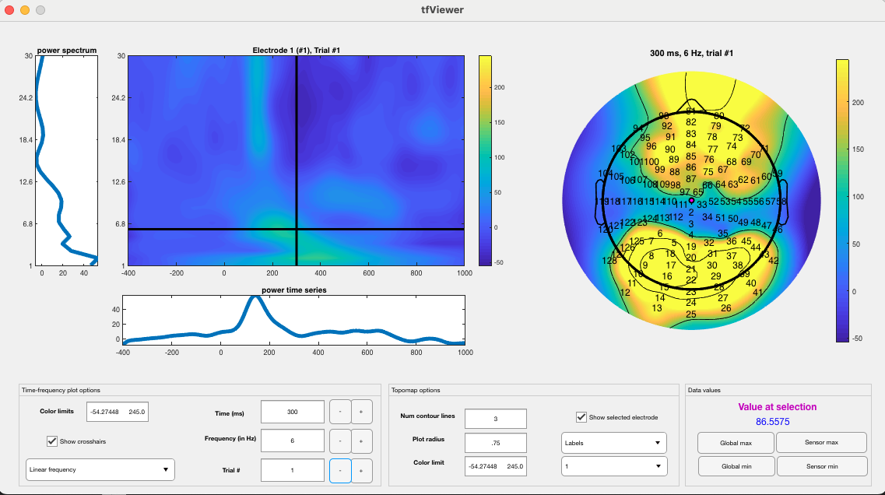
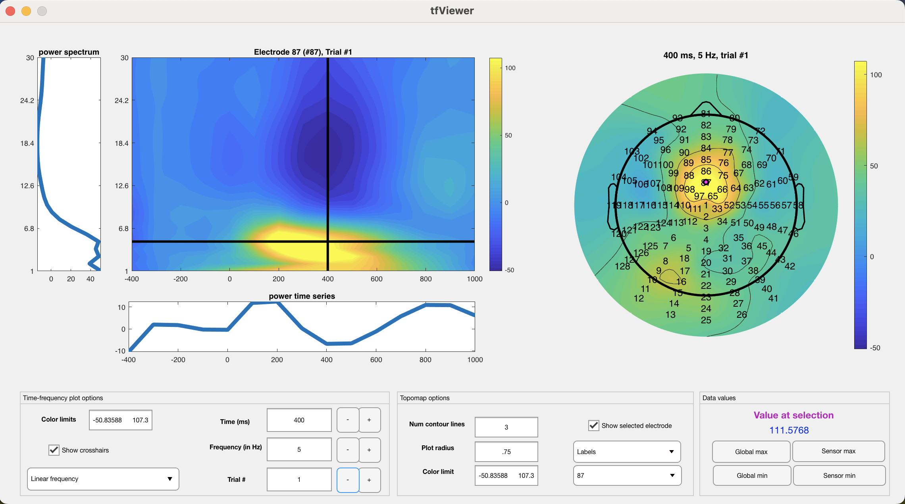
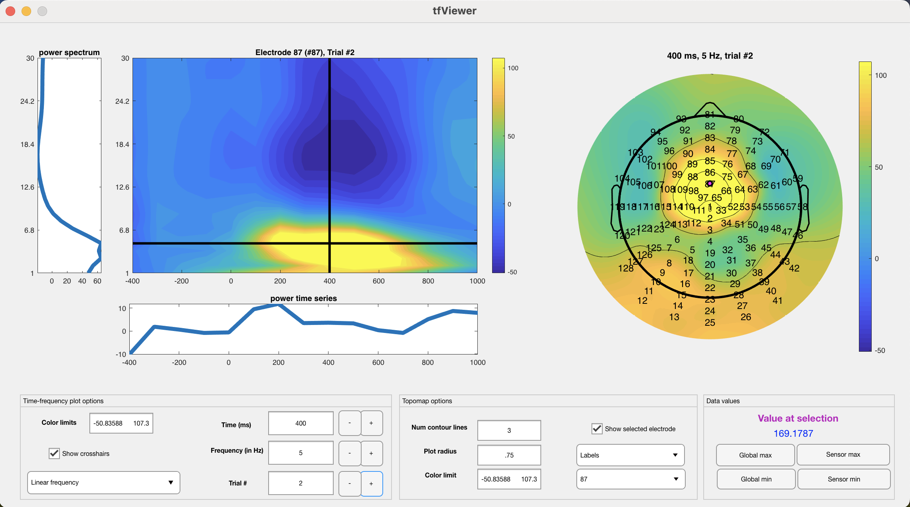

tutorial: wavelet study
=======================

We will be going through the steps of completing a wavelet-based TF study using a publicly available EEG dataset available on the Open Science Foundation. These data were recorded from healthy volunteer subjects during a Flanker task assessing cognitive control.

First, you will need to download the data. They have already been downsampled to 250 Hz so the size is not huge. Find the data at: https://osf.io/hgc65/

Once the data are downloaded, you can inspect and preprocess them in EEGLAB. We used the latest version available, but any version should work. Code for preprocessing is available in the OSF repository for this same project. Note that NeuroFreq does not incorporate preprocessing.

Once the data are prepared to your satisfaction, navigate to the folder containing the preprocessed EEG data, and generate a list of the files using the MATLAB dir.m function:

.. code-block:: matlab
  files = dir('*.set');

Data can be loaded into memory using the EEGLAB pop_loadset.m function. Do this on the first dataset:

.. code-block:: matlab

  EEG = pop_loadset ( [files(1).folder filesep files(1).name] );

Define our times and frequencies of interest:

.. code-block:: matlab

  foi=1:1:30;
  toi=[-.4 1];

Now, mean-center the data, remove quadratic trends, and apply a cosine-square (Tukey) taper to the end 5% of the segments prior to TF decomposition:

.. code-block:: matlab

  EEG = nf_prepdata( EEG );

Calculate a wavelet transform using the default parameters:

.. code-block:: matlab

  TF = nf_tftransform(EEG,'plt',0,'freqs',foi,'times',toi,...
    'method',  'wavelet');           %Morlet discretized wavelet

Now, average the TF structure into congruent/incongruent trials. Trial-level information is contained in the 'behavior' field of TF sets output by NeuroFreq. Apply a baseline using %-change:

.. code-block:: matlab

  TF = nf_avebase(TF,'percent',[-.4 -.2],[TF.behavior.Cong]);
  
The output can be examined using the following:

.. code-block:: matlab
  
  nf_viewerapp( TF );

Which will produce the following:

Now, we need to put all of these steps in a loop. First, create a folder to hold the outputs. From now on, we will call the directory of this folder 'nf_out_path', but that should reflect an actual path on your computer. For this demonstration, we will analyze only the first 15 files to save time and space.

.. code-block:: matlab

  for i=1:15
      %load set
      EEG = pop_loadset ( [files(i).folder filesep files(i).name] );
      %prep data
      EEG = nf_prepdata( EEG );
      %TF transform
      TF = nf_tftransform(EEG,'plt',0,'freqs',foi,'times',toi,'method','wavelet'); %Morlet discretized wavelet
      %average and baseline correct
      TF = nf_avebase(TF,'percent',[-.4 -.2],[TF.behavior.Cong]);
      %downsample to briefer time vector for convenience
      TF = nf_resample(TF, [-.4:.1:1], []);
      %save it
      save([nf_out_path filesep files(i).name], 'TF');
  end

This will run for a while as all of the datasets are TF-transformed. Once they are all finished and saved, you can use the nf_aggregate.m function to aggregate the sets into a multi-subject dataset for analysis.

.. code-block:: matlab
  
  TF = nf_aggregate

This function will bring up a dialogue box, prompting selection of multiple datasets for aggregation. Once all 15 datasets are selected, click the 'open' button to aggregate the data. This will output a multi-subject TF structure for further analysis.

If you enter 'TF' at the command line to inspect the new structure, you will see the following:

.. code-block:: matlab
  
  TF = 

  struct with fields:

        power: [5-D double]
        phase: [5-D double]
    nsubjects: 15
        freqs: [1 2 3 4 5 6 7 8 9 10 11 12 13 14 15 16 17 18 19 20 21 22 23 24 25 26 27 28 29 30]
        times: [-0.4000 -0.3000 -0.2000 -0.1000 0 0.1000 0.2000 0.3000 0.4000 0.5000 0.6000 0.7000 0.8000 0.9000 1]
           Fs: 10
        conds: 2
        scale: 'linear'
     chanlocs: [1×128 struct]
     behavior: [1×30 struct]

You can view the multi-subject set the same way you would view a single-subject set (this will show an average over multiple subjects, per condition):

.. code-block:: matlab
  
  nf_viewerapp( TF );

Note that the 15-subject average is very clean and shows a notable mediofrontal focus for theta. You can click the buttons next to 'time', 'frequency', and 'trial' to flip through time points, frequencies, and task conditions (congruent/incongruent) respectively. You can click sensors on the topo plot to the right to move the TF surface view to that sensor. Click sensor '87' and go to t = 400 ms and f = 5 Hz (the focus of mediofrontal theta). Then, use the 'trial' button to flip between congruent/incongruent conditions. You will see a noticeable increase in mediofrontal theta during incongruent trials:

Congruent:

Incongruent:

This increase can be confirmed statistically by extracting an ROI around mediofrontal theta and using a pair-samples t-test on the data:

.. code-block:: matlab
  
  %sensor 87, frequency bin 5 (corresponding to 5 Hz), time bin 9 (corresponding to 400 ms)
  congruent_theta = squeeze(TF.power(:,87,5,9,1));
  incongruent_theta = squeeze(TF.power(:,87,5,9,2));
  
  %t-test the data
  [h, p, ci, stats] = ttest( incongruent_theta-congruent_theta );

This difference is confirmed statistically: t(14) = 2.97, p = .01, 95% CI of difference = [15.98 99.22]. Of course, in an actual study one should not look for differences visually and then extract data after observing a difference, but it is sufficient for the purposes of this tutorial and shows the well-known mediofrontal increase in theta during incongruent trials on a flanker task.

Other datasets can be analyzed in a similar way, to rapidly generate study-level results using NeuroFreq. Arbitrary trial vectors with as many entries as unique trial types can be supplied during averaging, and the nf_aggregate function will automatically make sure every TF set has consistent channel locations, time and frequency vectors, and conditions. Happy analyzing!

