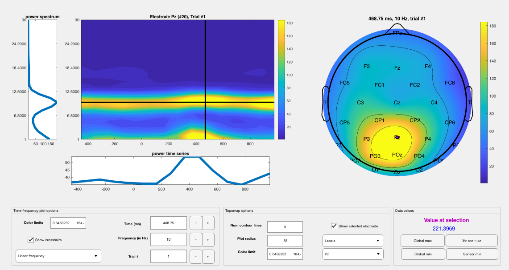

nf_viewerapp
==============

An interactive visualization of TF structures, including topographic plots and surface plots (at specified sensors) can be generated with the function

.. code-block:: matlab
   
  TF = nf_viewerapp( TF );

The viewer app allows the option of scrolling through single-trials for unaveraged data, and scrolling through time and frequency points for averaged or single-trial data. The topographic plot will automatically update when the trial, time point, or frequency point are changed, and the surface plot will automatically change when the scalp electrode is changed. This function uses code included in Mike X. Cohen’s excellent open-source tool tfviewerx.m, and includes extra utilities for visualizing and scrolling single-trial data.

